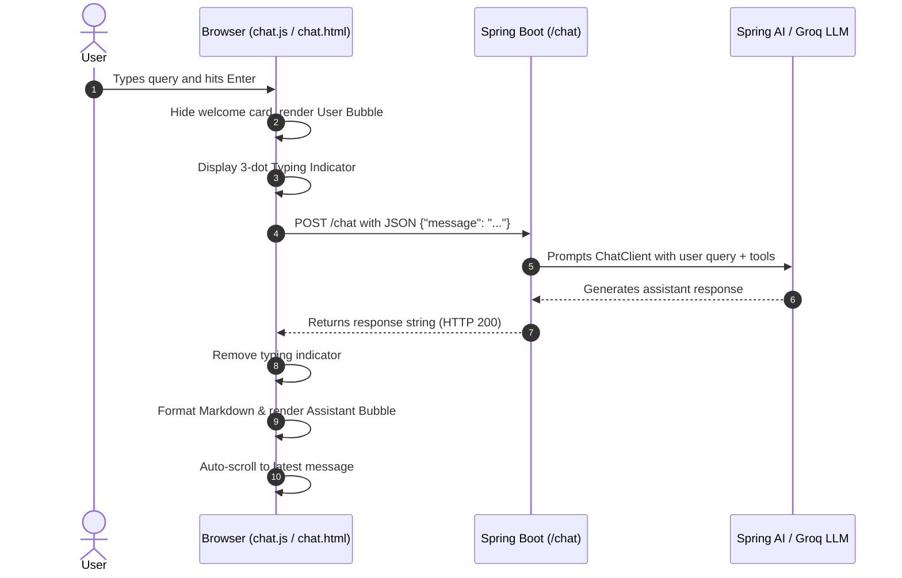

# Frontend Documentation — Classic Chat UI

This document provides a comprehensive overview of the frontend architecture, file organization, styling, and client-side logic for the Spring AI Chat application.

---

## 📑 Table of Contents
- [Architecture Overview](#architecture-overview)
- [Directory Structure](#directory-structure)
- [File Breakdown: Which File Handles What](#file-breakdown-which-file-handles-what)
  - [1. templates/chat.html](#1-templateschathtml)
  - [2. static/js/chat.js](#2-staticjschatjs)
  - [3. static/css/styles.css](#3-staticcssstylescss)
  - [4. controller/PageController.java](#4-controllerpagecontrollerjava)
- [Data Flow & API Integration](#data-flow--api-integration)
- [Key Features](#key-features)
- [How to Run and Test](#how-to-run-and-test)
- [Customization Guide](#customization-guide)

---

## Architecture Overview

The frontend is built with a lightweight, server-rendered stack without heavy JavaScript frameworks (such as React or Angular):
- **Templating**: [Thymeleaf](https://www.thymeleaf.org/) (Server-Side Rendering within Spring Boot)
- **Styling**: [Tailwind CSS](https://tailwindcss.com/) (loaded via CDN) + Custom CSS
- **Scripting**: Pure Vanilla JavaScript (ES6+, modern `fetch` API, no external libraries)

```
+-------------------------------------------------------------------+
|                        Browser Client                             |
|                                                                   |
|   +-----------------------------------------------------------+   |
|   | templates/chat.html (HTML5 + Tailwind utility classes)    |   |
|   +-----------------------------------------------------------+   |
|            |                                           |          |
|            v                                           v          |
|   +-------------------+                       +---------------+   |
|   | static/css/       |                       | static/js/    |   |
|   | styles.css        |                       | chat.js       |   |
|   | (Custom styling)  |                       | (Chat logic)  |   |
|   +-------------------+                       +---------------+   |
+-------------------------------------------------------|-----------+
                                                        |
                                          POST /chat    | JSON Request
                                                        v
+-------------------------------------------------------------------+
|                     Spring Boot Backend (Port 8082)               |
|                                                                   |
|   - PageController.java  --> Serves "/" and "/chat-ui"            |
|   - ChatController.java  --> Handles POST /chat                   |
|   - ChatService.java     --> Integrates with Spring AI            |
+-------------------------------------------------------------------+
```

---

## Directory Structure

```text
src/main/
├── java/com/coding/agent/backend/controller/
│   ├── PageController.java        # Serves the HTML view
│   └── ChatController.java        # Handles /chat REST API endpoint
└── resources/
    ├── templates/
    │   └── chat.html              # Main Thymeleaf HTML template
    └── static/
        ├── css/
        │   └── styles.css         # Animations, markdown formatting, scrollbar
        └── js/
            └── chat.js            # Client-side chat logic & API communication
```

---

## File Breakdown: Which File Handles What

### 1. `templates/chat.html`
**Location:** `src/main/resources/templates/chat.html`  
**Purpose:** Defines the layout, DOM elements, and structural hierarchy of the user interface.

- **Header Section (`<header>`)**:
  - Displays the bot avatar and title ("Spring AI Assistant").
  - Includes a live online status badge (`#statusBadge`).
  - Contains the "Clear" conversation button.
- **Message Area (`<main id="chatMessages">`)**:
  - Scrollable container where chat bubbles are dynamically appended.
  - Houses the **Welcome Card (`#welcomeCard`)** displayed on initial load with 4 quick starter prompts:
    1. *In-Stock Products* (`What products are currently in stock?`)
    2. *Track Order* (`What is the status of order 1042?`)
    3. *Stock Summary* (`How many total products are available in the inventory?`)
    4. *Cancel Order* (`Can you cancel order 1043?`)
- **Input Dock (`<footer>`)**:
  - Auto-resizing textarea (`#messageInput`) for user typing.
  - Send button (`#sendBtn`) with paper-plane icon.
  - Keyboard hint badge: `Enter` to send, `Shift+Enter` for newline.
- **Thymeleaf Integration**:
  - Resolves static assets cleanly via `th:href="@{/css/styles.css}"` and `th:src="@{/js/chat.js}"`.

---

### 2. `static/js/chat.js`
**Location:** `src/main/resources/static/js/chat.js`  
**Purpose:** Handles all user interactions, API calls, DOM manipulation, and response rendering.

| Function / Handler | Description |
| :--- | :--- |
| `sendMessage()` | Reads textarea input, hides welcome card, renders user bubble, activates typing indicator, and executes `fetch('/chat')`. |
| `sendSuggestion(text)` | Injects the prompt text from a suggestion card and triggers `sendMessage()`. |
| `appendMessage(data)` | Dynamically constructs and injects chat bubbles for both `user` (blue bubble, right-aligned) and `bot` (white card bubble, left-aligned) with timestamps. |
| `appendErrorMessage(err)` | Renders a styled red alert bubble if the server or network returns an error. |
| `showTypingIndicator()` | Displays the 3 animated bouncing dots ("*Assistant is typing...*") while waiting for the backend. |
| `removeTypingIndicator()` | Removes the typing indicator once the response arrives. |
| `setWaitingState(waiting)`| Disables/enables textarea and send button; updates status badge text. |
| `autoResize(textarea)` | Dynamically calculates and expands the textarea height up to a max of `140px`. |
| `handleKeyDown(event)` | Intercepts keyboard events (`Enter` sends message, `Shift+Enter` allows multiline typing). |
| `formatMarkdown(text)` | Converts raw markdown into HTML: code blocks, inline code, bold text, italics, lists, and line breaks. |
| `copyCode(button)` | Copies code inside syntax blocks to clipboard and displays temporary "Copied!" feedback. |
| `clearChat()` | Resets the conversation feed and restores the welcome card. |

---

### 3. `static/css/styles.css`
**Location:** `src/main/resources/static/css/styles.css`  
**Purpose:** Custom CSS enhancements beyond standard Tailwind utility classes.

- **Custom Scrollbars (`#chatMessages::-webkit-scrollbar`)**:
  - Slim, smooth, rounded scrollbar styling matching modern messenger apps.
- **Keyframe Animations**:
  - `.message-enter`: Smooth slide-up transition (`messageSlideIn`) when new bubbles appear.
  - `.typing-dot`: Pulsing and scaling dot bounce animation (`typingBounce`) for the typing indicator.
- **Markdown Prose (`.ai-content`)**:
  - Formats lists (`ul`, `ol`, `li`), bold tags, inline code badges, and blockquotes.
  - Styles code block containers (`.code-block-wrapper`, `.code-block-header`, `pre`, `code`).

---

### 4. `controller/PageController.java`
**Location:** `src/main/java/com/coding/agent/backend/controller/PageController.java`  
**Purpose:** Spring MVC web controller that serves the chat page.

```java
@Controller
public class PageController {

    @GetMapping({"/", "/chat-ui"})
    public String chatPage() {
        return "chat"; // Resolves to src/main/resources/templates/chat.html
    }
}
```

---

## Data Flow & API Integration



### Request Specification
- **URL:** `/chat`
- **Method:** `POST`
- **Headers:** `Content-Type: application/json`, `Accept: text/plain, application/json`
- **Payload:**
  ```json
  {
    "message": "What products are currently in stock?"
  }
  ```
- **Response:** Plain text or markdown string returned by the assistant.

---

## Key Features

1. **Classic Conversational Design**:
   - Distinct, readable bubbles with sender avatars and timestamps.
   - User messages aligned right in classic blue (`#2563eb`).
   - Assistant messages aligned left in clean white cards with border and soft drop-shadow.
2. **Interactive Starter Prompts**:
   - Quick chips for one-click testing of inventory and order queries.
3. **Rich Code Snippets with Copy Button**:
   - Code blocks rendered with language headers and interactive copy buttons.
4. **Resilient UX**:
   - Disables inputs during API processing to prevent duplicate submissions.
   - Shows clear, friendly error messages if the backend or LLM fails.
   - Smooth auto-scrolling to the latest incoming message.

---

## How to Run and Test

### 1. Start the Backend Server
In the root directory of the project, execute:
```powershell
.\mvnw.cmd spring-boot:run
```
*(Or `./mvnw spring-boot:run` on macOS/Linux).*

### 2. Access the Application
Open any web browser and visit:
- **`http://localhost:8082/`** or **`http://localhost:8082/chat-ui`**

### 3. Run Automated Frontend Route Tests
```powershell
.\mvnw.cmd test -Dtest=PageControllerTest
```

---

## Customization Guide

- **Change Color Scheme**:
  - In `chat.html`, modify the `brand` palette in the `tailwind.config` block.
  - In `chat.js`, modify `bg-blue-600` classes in `appendMessage()` to customize user bubble colors.
- **Change Starter Prompts**:
  - In `chat.html`, locate `#welcomeCard` and modify the button labels and `sendSuggestion('...')` arguments.
- **Adjust Max Input Height**:
  - In `chat.js`, edit `Math.min(textarea.scrollHeight, 140)` inside `autoResize()`.

